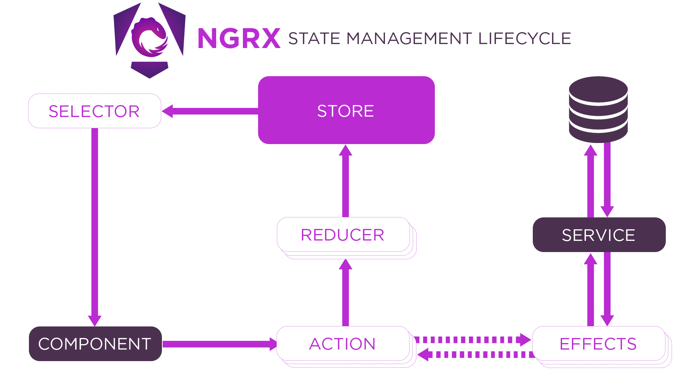

# Restaurant Management System

## Overview
This project is aimed at optimizing the management of restaurant operations using **Angular** and **NgRx**. The application addresses key challenges commonly faced in restaurants, such as inefficient table reservation systems, order management delays, and inventory tracking issues. By leveraging NgRx for state management, this project provides a scalable and maintainable solution for restaurant operations.

## Project Goals
The goal of this project is to develop an Angular application that solves at least **3 key problems** encountered in restaurant management. Each developer will propose a technical solution using Angular, NgRx, and local storage for persistence.

## Problems Addressed
This project will address the following key issues in restaurant management:
1. **Table Reservation** - Streamlining the table booking process for customers and restaurant staff.
2. **Order Management** - Managing customer orders efficiently with real-time updates.
3. **Inventory Management** - Keeping track of stock levels and notifying staff when stock is low.

## Technologies Used
- **Angular** - Frontend framework for building the application.
- **NgRx** - State management library for Angular to handle global application state.
- **LocalStorage** - For storing application data and ensuring persistence.
- **Angular Material** - UI components for building modern, responsive interfaces.



## Features
- **Table Reservation System**: Allows customers to book tables and view availability in real-time.
- **Order Management**: Allows restaurant staff to view and manage orders.
- **Inventory Tracker**: Monitors stock levels and sends alerts when items are running low.
- **NgRx State Management**: Utilizes NgRx Store, Actions, Reducers, Selectors, and Effects to manage global state in a reactive way.

## Project Structure 

src/  
├── app/  
│   ├── core/  
│   │   ├── services/     
│   ├── shared/  
│   │   ├── components/  
│   │   └── utilities/  
│   ├── features/   
│   │   ├── admin/  
│   │   └── menu/  
│   ├── store/  
│   │   ├── actions/  
│   │   ├── reducers/  
│   │   ├── effects/  
│   │   ├── selectors/  
│   │   └── state/  
│   └── app.component.ts  
└── assets/

## Setup

### Prerequisites
- **Node.js** (latest LTS version)
- **Angular CLI**
- **Git** (for version control)

### Install Dependencies
1. Clone the repository:
   ```bash
   git clone https://github.com/sanaa-ennaji/GustoFlow
   cd Gusto-Flow

   ```
Install NgRx if Not Already Installed:
First, ensure you have NgRx installed in your project.

 ```bash
 npm install
ng add @ngrx/store
npm install @ngrx/effects @ngrx/store-devtools @ngrx/entity
ng serve
   ```
   - to create a components for example plate edit
    
     ```bash
     ng generate component features/admin/users/plate-edit
     ```
- Visit http://localhost:4200 to see the application in action.
